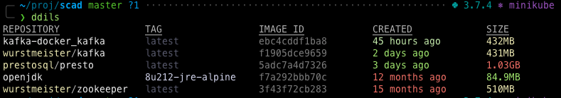

# Shell Colorized Aliases for Docker (SCAD)

Docker commands ~~are~~ were tedious to type.



This project defines [Docker][1] aliases (and a few functions) for
shells (zsh, bash, fish), with colorized output for many commands, and
[fuzzy completions](https://github.com/jhawthorn/fzy).

These aliases adhere to the
[newer style](https://blog.couchbase.com/docker-1-13-management-commands/) of
organizing and invoking docker with *management commands* rather than
the notoriously confusing “random solo commands”.

This work was inspired by
[akarzim/zsh-docker-aliases](https://github.com/akarzim/zsh-docker-aliases).
It uses [GRC](https://github.com/garabik/grc) and jq for colorized
Docker command output.

## How to Install

### With [zplug][2]

```sh
zplug "MicahElliott/scad"
zplug "greymd/docker-zsh-completion" # and completions!
```

## Usage Tips

This was put together with Zsh in mind; YMMV for other shells.

These shell aliases are all short mnemonics for docker **management
commands** (eg, `container`, `image`, `volume`), and **subsystems**
(eg, `compose`), and just a few **basic commands** (whose use are
discouraged; eg, `ps`, `build`).  The commands all start with a `d`
(by default, configurable) and take form like `dcls` (*container ls*)
and `dcb` (*container build*).

Any aliases that end with a capital letter require an extra argument.
E.g., `dcrD` means “run a docker container, in detached mode, with a
name that must be specified.

With such a voluminous set of commands, it’s helpful to use zsh’s tab
completion constantly to explore what you’re actually trying to
invoke.  Say you’re just looking for a basic command…

«demonstration here»

Think in terms of *management commands*: Containers, Images, Volumes,
Networks, System, Daemon.

Compose and Machine are their own separate systems, and maybe Compose
is the only one you’ll care about, so get used to typing `dk<tab>` for
all of its commands.

If you’re using (any parts of) oh-my-zsh, use `CASE_SENSITIVE="true"`
to make alias completion differentiation sane.  This way typing
`dc<tab>` will be distinguished from `dC<tab>`.

SCAD works well with [podman](https://podman.io/) too! Just:
`alias docker=podman`, and the completions should all work fine.

## Help System

### run-help (bound to `M-h`)

See [this solution](https://stackoverflow.com/a/46415388/326516) for
conveniently seeing alias definitions on-the-fly.

### Extra provided help

All the management commands include a `?` suffixed command.  So you
can see all the _container_ commands with:

```shell
❯ dc?
Docker CONTAINER commands:
dca   — Attach local standard input, output, and error streams to a running container
dcci  — Commit a new image from a container’s changes
dccp  — Copy files/folders between a container and the local filesystem
…
```

There is a top-level help also:

```shell
❯ d?
Docker Alias Help

MOST COMMON
  db Builder
  dc Container
  di Image
  dn Network
  dv Volume

LESS COMMON
  df conFig
  dx conteXt
…
```

The help is all built in, so these won’t be documented in this README!

You can get subcommand help by invoking it with `--help`:

```shell
❯ dcr --help

Usage: docker container run [OPTIONS] IMAGE [COMMAND] [ARG...]

Run a command in a new container

Options:
      --add-host list                  Add a custom host-to-IP mapping (host:ip)
  -a, --attach list                    Attach to STDIN, STDOUT or STDERR
…
```

### Apropos

You can search all commands help.  E.g., you know there’s some command
to show you some top-like status of your containers, but you can’t
think of it.  Use `da` for apropos-searching.

```shell
❯ da cpu
  dcst  — Display a live stream of container(s) resource usage statistics (cpu, mem)

❯ da stop
  dcpr  — Prune/remove all stopped containers
  dcs   — Start one or more stopped containers
  dcx   — Stop one or more running containers
  dcw   — Wait/block until one or more containers stop, then print their exit codes
```

### Alias Expansion

You can see expand an alias in Zsh with `C-x a`. This is another
useful way to inspect or edit a full command when needed.

## Author

*The author of this module should be contacted via the [issue tracker][3].*

- [Micah Elliott](https://github.com/MicahElliott)

[1]: https://www.docker.com/
[2]: https://github.com/zplug/zplug
[3]: https://github.com/MicahElliott/scad/issues
